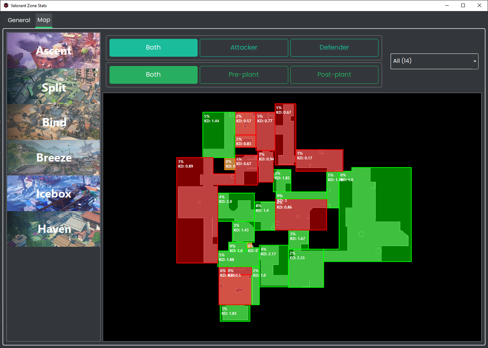
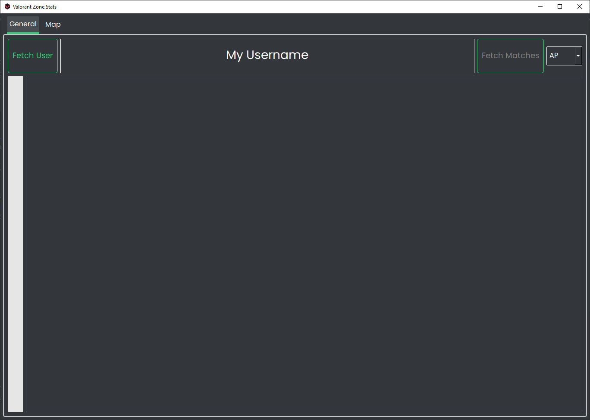

<h1 align="center">
   
  
   
  Valorant-Zone-Stats
   
</h1>

> Inspired by [Leetify](https://leetify.com)'s awesome Map Zones Tool for CS:GO

A simple desktop program to view your VALORANT performance in different areas across all maps!

## Quick Links
- [Installation](#installation)
- [Usage](#usage)
- [Building](#building)
- [Credits](#credits)
- [TODO](#todo)
- [How?](#how)
- [Legal Disclaimer](#legal-disclaimer)

## Installation
Download the exe from the [latest release](https://github.com/LouisAsanaka/valorant-zone-stats/releases), then 
double-click to run the program!

Alternatively, download the zip in the [release]((https://github.com/LouisAsanaka/valorant-zone-stats/releases)).
Extract it to anywhere you would like, then run 
`valorant-zone-stats.exe`. 

**Info**: Application data is stored in your APPDATA folder, typically 
`C:\Users\USERNAME\AppData\Roaming\Valorant-Zone-Stats`.
 

Explanations for each file:
- `matches.db`: Stores your past matches for analysis, since Riot does not provide all past matches.
- `storage.json`: Keeps track of matches the program should ignore (e.g. deathmatch) to reduce loading time.
- `settings.ini`: Stores your settings, currently only your region.
  
## Usage
Make sure the program is running on a computer where you are logged into VALORANT. Click on the "Fetch User" button, 
then click on the "Fetch Matches" button. This may take a while the first time, since it will be grabbing your recent 
matches from VALORANT. If matches do not appear, try changing your region (which is automatically detected the first
time you run the program. 

The regions are: NA (North America), AP (Asia Pacific), EU (Europe), KO (Korea), BR (Brazil), LATAM (Latin America)

Once a list of your recent matches is populated, navigate to the "Map" tab on the top left. From there, you can choose
the map you would like to see your zone stats in, as well as filter by attacker/defender/both side.

You are also able to click into each zone to see the specific kills/deaths that occurred. You can also zoom with your
scrollwheel and pan by dragging on the map.

### Icon Legend
- Solid Green: Position where you killed someone
- Empty Green: Position of the victim
- Solid Red: Position where you died
- Empty Red: Position of the killer
 

**Note** that you will need to fetch matches again when you open the program again in the future. It should be a bit faster
since all your older matches are already stored on your computer.

## Building
Python 3.8.8 was used to develop this program.

Create a virtualenv with the dependencies (listed in `requirements.txt`), start a terminal in the root directory of the
project, activate the virtualenv, then execute `run.bat`.

To package the program run either `build.bat` (for a folder) or `build_onefile.bat` (for a single exe). Don't forget to
activate the virtualenv first!

## Credits
- [Leetify](https://leetify.com) for the inspiration
- Images
    - [Honeycomb Icon Valorant V1](https://www.deviantart.com/mauriliosm/art/Honeycomb-Icon-Valorant-V1-862209442) by 
      [MaurilioSM](https://www.deviantart.com/mauriliosm), under the Creative Commons Attribution 3.0 License
    - [Location Line Icon](https://iconscout.com/icon/location-pin-marker-destination-place-gps-hotel-9) by Mohit Gandhi,
      under [Iconscout's license](https://iconscout.com/licenses#iconscout)
    - Map Images (under resources/maps) courtesy of [valorant-api.com](https://valorant-api.com/), who probably got it
      from VALORANT itself
- Some code from [valclient.py](https://github.com/colinhartigan/valclient.py) by 
  [colinhartigan](https://github.com/colinhartigan)
- floxay#8682 on Discord for suggestions for offline authentication
      
## TODO
- [ ] Make UI polygons non-rectangular (match the shape of the map)
- [ ] Add more filters for statistics (e.g. per-agent)
- [ ] Improve match list and add statistics for each match
- [ ] Improve color coding for the maps (current it is green if K/D >= 1.0, red otherwise)
- [ ] Potentially remake the map zones
- [x] Analyze other types of matches (unrated & customs) instead of only competitive
- [x] Offline mode (without needing VALORANT to be running)

## How?
The program uses the same data the careers page gets (scoreboard, timelines, performance). The polygons that form the
map zones were handcrafted in [Desmos](https://desmos.com), based on a general idea of the map zones. A small script is
used to convert Desmos polygons into a format the code can utilize (namely the 
[Shapely](https://shapely.readthedocs.io/en/stable/) library).
      
## Legal Disclaimer
This project is in no way affiliated with Riot Games. It only uses VALORANT's client API to download matches on behalf
of the user.